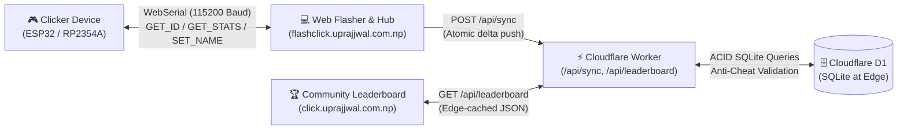

# Clicker Project 🎮

Official repository for the Clicker handheld device ecosystem, encompassing production firmware, hardware schematics, PCB designs, automated asset build pipelines, and browser-based WebSerial flashing tools.

---

## 📁 Repository Structure

```text
Click/
├── README.md                          <-- Master documentation and system overview
├── PROJECT_RULES.md                  <-- Protected subsystems, NVS rules & coding freeze
├── CHANGELOG.md                      <-- Comprehensive release history & architecture decisions
├── platformio.ini                    <-- PlatformIO configuration & automated build flags
├── build_release.bat                 <-- 1-Click Interactive firmware release packager
├── run_flasher.bat                   <-- 1-Click Localhost WebSerial server runner
├── flash_device.bat                  <-- 1-Click Desktop CLI serial flasher
├── hardware/                         <-- Electrical schematics & mechanical designs
│   ├── vector_designs.ai             <-- Vector graphics & enclosure laser/artwork
│   └── PCB/                          <-- KiCad PCB manufacturing & CAD files
│       ├── Click1/                   <-- Active prototype KiCad PCB & schematic (ESP32-WROOM-32E)
│       ├── Click4/                   <-- Next-Gen RP2354A PCB (JLCPCB PCBA Production V0.0.1)
│       └── Resources/                <-- Edge cut DXF files and mechanical templates
├── server/                           <-- Cloudflare Worker + D1 Serverless Leaderboard Backend
│   ├── worker.js                     <-- Edge API routes (/api/leaderboard, /api/sync)
│   ├── schema.sql                    <-- D1 SQLite schema (devices, global_stats, sync_log)
│   ├── wrangler.toml                 <-- Cloudflare Worker deployment configuration
│   └── README.md                     <-- 3-minute zero-cost deployment guide
├── firmware/                         <-- Modular C++ embedded firmware
│   ├── assets/screens/               <-- 1-bit screen bitmaps & sprites (.png)
│   ├── scripts/
│   │   ├── pre_build_assets.py       <-- PlatformIO pre-build hook (auto-converts assets)
│   │   ├── convert_assets.py         <-- Converts PNGs to C PROGMEM bitmap headers
│   │   ├── flash.sh                  <-- Flashing utility for macOS / Linux
│   │   └── flash.bat                 <-- Flashing utility for Windows
│   └── src/                          <-- Application source code & applets
│       ├── main.cpp                  <-- Application entry point, serial protocol & registry
│       ├── system/                   <-- Core OS, drivers & power management (untouched by applets)
│       │   ├── Applet.h              <-- Base class interface for all applets
│       │   ├── OSManager.h / .cpp    <-- Applet scheduler & sleep lifecycle
│       │   ├── PowerManager.h        <-- Light/Deep sleep, UART isolation & I2C recovery
│       │   ├── Display.h             <-- SSD1306 OLED singleton & 400kHz fast I2C
│       │   ├── InputManager.h / .cpp <-- Debounced button state machine & hold triggers
│       │   ├── battery.hpp           <-- Battery voltage, percentage & charging status
│       │   └── device_info.hpp / .cpp<-- eFuse MAC ID & customizable owner name
│       ├── applets/                  <-- Self-contained, modular games & apps
│       │   ├── clicker/              <-- Sisyphus uphill clicker game & physics engine
│       │   ├── timing_game/          <-- "Just 10 Seconds" accuracy timing game
│       │   ├── flappy_bird/          <-- Flappy Bird arcade obstacle game
│       │   ├── settings/             <-- Hardware status, voltage & device ID screen
│       │   └── screensaver/          <-- Snowfall particle animation on idle
│       ├── fonts/                    <-- Custom Adafruit GFX typography headers
│       ├── screens/                  <-- Legacy milestone overlay renderers
│       └── generated_assets/         <-- Auto-generated C bitmap headers
├── web_flasher/                      <-- WebSerial flashing & leaderboard site (flashclick.uprajjwal.com.np)
│   ├── index.html                    <-- Web application entry point
│   ├── flasher.html                  <-- Full-featured WebSerial flasher, personalizer & leaderboard UI
│   ├── app.js                        <-- WebSerial engine, personalization & leaderboard sync
│   ├── style.css                     <-- Cyberpunk terminal responsive styling
│   ├── manifest.json                 <-- ESP Web Tools manifest configuration
│   └── versions.json                 <-- Firmware release registry
├── tools/                            <-- Build & developer utilities
│   ├── release/release_manager.py    <-- Interactive version bumper & binary packager
│   ├── flasher/serve_flasher.py      <-- Zero-config HTTP server for web_flasher
│   └── converters/                   <-- TTF font and image conversion scripts
└── docs/                             <-- Architectural specifications
    ├── hardware_and_pinouts.md       <-- Detailed pin profiles (ESP32 vs RP2354A)
    ├── device_identification_and_leaderboard.md <-- eFuse MAC & database schema
    └── leaderboard_architecture.md   <-- Cloudflare Worker API & score sync model
```

---

## ⚡ Hardware Platforms & Pin Profiles

Detailed technical schematics and electrical specifications can be found in [`docs/hardware_and_pinouts.md`](docs/hardware_and_pinouts.md).

> [!NOTE]
> **Active Hardware & Production Status**:
> - **Active Prototype (Click 1)**: Up until now, boards have been fabricated manually. The **ESP32-WROOM-32E** was chosen because it is simpler and matches local prototyping resources. **All current firmware, active code, pin assignments, and WebSerial flashing run on this physical Click 1 board.** Design files are located in `hardware/PCB/Click1/`.
> - **Upcoming Production Hardware (Click 4 - V0.0.1)**: The design for the **Click 4** PCB is complete and prepared for turnkey assembly (PCBA) via **JLCPCB for the V0.0.1 production run**. It features the RP2354A MCU. Firmware adaptations for the RP2354A will be developed once the manufactured boards are in hand. Design files are in `hardware/PCB/Click4/`.

### Active Prototyping Hardware Specs (Click 1: ESP32-WROOM-32E)
- **Microcontroller**: ESP32-WROOM-32E (Xtensa Dual-Core 240MHz, 4MB Flash)
- **Display I2C**: SDA = GPIO 21, SCL = GPIO 22 (400kHz Fast I2C; *GPIO 36 is input-only*)
- **User Inputs**: MODE = GPIO 14 (RTC ext0 wake), ACTION = GPIO 32 (RTC ext1 wake)
- **Power & Battery**: STAT = GPIO 33 (Active LOW from ETA IC), BAT_ADC = GPIO 35 (100k/100k divider)
- **Serial & Power Isolation**: UART TX0 = GPIO 1, UART RX0 = GPIO 3 (isolated with pad holds in sleep)
- **Sleep States**: Light sleep at 20s (OLED off, I2C pullups held), Deep sleep at 45s (RTC wakeup)

### Upcoming Hardware Pinout & Specs (V4 / Click 4 PCB)
- **Microcontroller**: RP2354A (QFN-56 package, 30 GPIOs: GP0-GP29)
- **Display I2C**: SDA = GP20, SCL = GP21
- **User Inputs**: MODE = GP14, ACTION = GP32 (or assigned GP)
- **Power & Battery**: STAT = GP3 (or assigned GP), BAT_ADC = GP29 (ADC3)
- **Audio & LEDs**: Buzzer = GP27, APA102 Data = GP11, APA102 Clock = GP12
- **Voltage Regulator**: AP2112K-3.3 with EN tied to physical slide switch

---

## 🕹️ Applet Ecosystem & Gameplay

The firmware features an event-driven `OSManager` hosting four built-in applets and an idle screensaver:

### 1. Sisyphus Clicker (Default Applet)
* **Theme**: Sisyphus rolling his eternal boulder up a steep mountain slope.
* **Dynamics**:
  * **Boulder Physics**: Smooth rotation and position tracking based on player clicks.
  * **Stamina & Fatigue**: Continuous clicking builds fatigue; stopping causes Sisyphus to catch his breath.
  * **Full Integer Notation**: No abbreviated suffix truncation (e.g. `10,000+` and higher counts display fully).
  * **Milestone Celebrations**: Overlay banners trigger on reaching milestone tiers (1, 5, 10, 50, 100, 1000, etc.).
  * **Persistence**: Dual-key NVS backup storage (`nvs_a` / `nvs_b`) with checksum verification and wear-leveling.

### 2. Just Ten
* Precision stopwatch game challenging players to hold and release the button at exactly **10.0000 seconds**.
* Displays exact millisecond accuracy and tracks personal records.

### 3. Flappy Bird
* Real-time side-scrolling obstacle game featuring obstacle collision detection, velocity physics, and persistent high scores.

### 4. Settings & System Applet
* Accessible by holding the **MODE** button.
* Displays live battery percentage (quantized in 5% steps with hysteresis), instantaneous battery voltage, active charging status (`CHARGING` / `BATTERY`), unique 48-bit eFuse MAC ID, and firmware build version.

### 5. Snowfall Screensaver
* Ambient particle simulation that activates automatically when the device remains idle prior to entering sleep.

---

## 🎮 Controls & Navigation Guide

| Action | Control | Description |
|:---|:---|:---|
| **Cycle Applets** | `MODE` Button (Short Press) | Switch between **Clicker**, **Just Ten**, and **Flappy Bird**. |
| **Settings Menu** | `MODE` Button (Hold > 1s) | Toggle the **Settings & System Status** screen. |
| **Primary Game Action** | `ACTION` Button (Short Press) | Push boulder / Jump bird / Start & Stop 10s timer. |
| **Reset Game Score** | `ACTION` Button (Hold > 3s) | Reset the score/counter of the currently active applet. |
| **Wake from Sleep** | Either Button (`MODE` or `ACTION`) | Instantly wakes the device from Light Sleep or Deep Sleep. |
| **Factory Master Reset** | **Both Buttons Held** (> 4s) | Erase all NVS partitions, resetting lifetime clicks and milestones. |

---

## 🛠️ Adding New Applets (Developer Guide)

The system firmware (`firmware/src/system/`) provides an isolated runtime environment. You or any contributor can add new games or micro-apps without touching, altering, or risking the core OS, sleep managers, or display drivers:

1. **Create an Applet Folder**: Create a directory in `firmware/src/applets/` (e.g., `firmware/src/applets/snake/`).
2. **Implement the `Applet` Interface**:
   ```cpp
   #pragma once
   #include "system/Applet.h"
   #include "system/Display.h"

   class SnakeApplet : public Applet {
   public:
       void init() override { /* Setup game state */ }
       void update() override { /* Real-time physics / tick loop */ }
       void draw() override { /* Draw frame on display */ }
       void cleanup() override { /* Teardown temporary state */ }
       void onActionClick() override { /* Handle ACTION button press */ }
   };
   ```
3. **Register in `firmware/src/main.cpp`**:
   ```cpp
   #include "applets/snake/SnakeApplet.h"
   SnakeApplet snakeApplet;

   // In setup():
   osManager.registerApplet(&snakeApplet);
   ```

All input debouncing, display clocking (400kHz Fast I2C), light sleep (20s), deep sleep (45s), and RTC wakeups continue working automatically in the background.

---

## 🚀 Building, Flashing & Updating

### 1. Web Flasher (Recommended)
* **Online**: Connect your device and visit [flashclick.uprajjwal.com.np](https://flashclick.uprajjwal.com.np).
* **Local Server**: Double-click [`run_flasher.bat`](run_flasher.bat) or run:
  ```bash
  python tools/flasher/serve_flasher.py
  ```

### 2. Desktop Command-Line Flashing
* **Windows**: Run [`flash_device.bat`](flash_device.bat).
* **macOS / Linux**:
  ```bash
  chmod +x firmware/scripts/flash.sh
  ./firmware/scripts/flash.sh
  ```

### 3. Building via PlatformIO
The project uses PlatformIO with an automated asset compilation hook.
```bash
# Compile firmware (automatically triggers pre-build asset conversion)
pio run -e esp32doit-devkit-v1

# Upload directly over USB serial
pio run --target upload

# Open serial monitor
pio device monitor -b 115200
```

### 4. Automated Asset Pipeline
Screen graphics placed in `firmware/assets/screens/` are converted to C headers before every compile:
```bash
python firmware/scripts/convert_assets.py
```

### 5. Official Release Packaging
To build an official release, bump semantic versions, and generate 3-part manifests for WebSerial:
```bash
# Windows
.\build_release.bat

# Python direct
python tools/release/release_manager.py
```

## 🌐 Community Leaderboard & Edge Cloud Architecture

The Click ecosystem features a fully connected, zero-maintenance, zero-cost ($0/month) serverless stack running on **Cloudflare Workers** and **Cloudflare D1 (Serverless SQLite)**:



### 1. The "Community Boulder" Mechanic 🪨
* Unlike isolated single-player games, every single click registered on any Clicker device contributes to the **Global Community Boulder**.
* When players connect to the Web Flasher and sync their device, their delta clicks are atomically added to `global_stats.total_boulder_clicks`.
* The live web interface visualizes the worldwide community progress as one shared mountain ascent.

### 2. Anti-Cheat & Physical Rate Limiting 🛡️
* The Cloudflare Worker enforces strict human-velocity checks on every sync request:
  * Delta clicks are validated against elapsed time between syncs (enforcing a physical maximum cap of ~15–20 clicks per second).
  * Excessive or impossible spikes are flagged and rejected, ensuring the Community Boulder and leaderboard rankings remain authentic.
  * Every sync transaction is immutably audited in the `sync_log` table with delta claims and hash signatures.

### 3. Device Personalization & Custom Bootscreen ✨
* Clickers are uniquely identified by their factory eFuse MAC address (e.g. `3C71BF89A1B2`).
* Through the Web Flasher interface, players can set a custom owner name (e.g. `"Prajjwal's Click"`).
* This name is transmitted via WebSerial (`SET_NAME:<name>`) and saved directly into the device's persistent NVS storage (`device` namespace).
* Upon reboot, the physical SSD1306 OLED screen proudly renders the personalized owner name on the boot splash screen.

### 4. Interactive WebSerial Command Protocol 🔌
The firmware exposes a lightweight ASCII command parser on UART0 (115200 baud) for browser-based management:
* `GET_ID` &rarr; Returns `ID:<12-hex-chip-id>`
* `GET_NAME` &rarr; Returns `NAME:<owner_name>`
* `SET_NAME:<name>` &rarr; Writes name to NVS and returns `OK:NAME_SET`
* `GET_STATS` &rarr; Returns structured game metrics: `CLICKS:<n>,FLAPPY:<n>,JUST_TEN:<n>`
* `RESET_STATS` &rarr; Resets active applet statistics

### 5. Live Links & Deployment
* **Live Community Leaderboard**: [click.uprajjwal.com.np](https://click.uprajjwal.com.np)
* **Web Flasher & Device Hub**: [flashclick.uprajjwal.com.np](https://flashclick.uprajjwal.com.np)
* **Backend Source & Deployment Guide**: [`server/README.md`](server/README.md)

