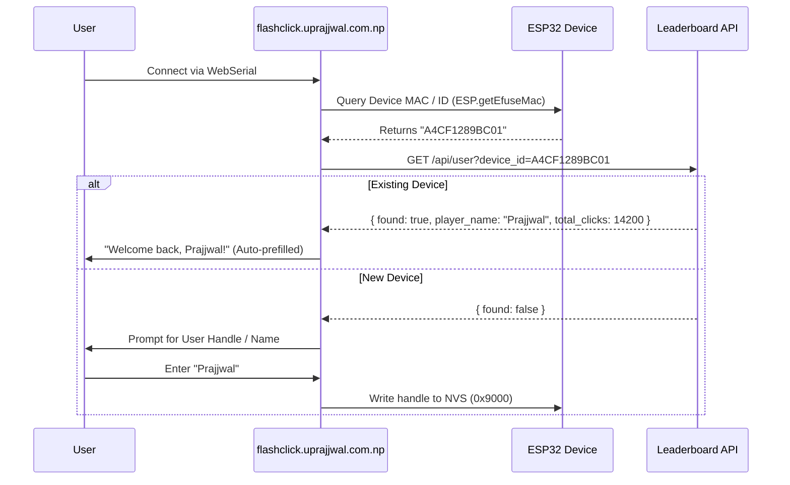

# Unique Device Identification & Leaderboard Persistence Architecture

This document describes how devices are identified uniquely via factory eFuse MAC addresses, how the WebSerial flasher auto-recognizes returning users, and the database synchronization model for the community leaderboard.

---

## 1. ESP32 Unique Hardware Identifier (`firmware/src/device_info.hpp`)

Each device derives an immutable hardware ID from its factory-burned 48-bit eFuse MAC:

```cpp
#pragma once
#include <Arduino.h>
#include <esp_system.h>

class DeviceInfo {
public:
    static String getID() {
        uint64_t chipid = ESP.getEfuseMac();
        char idStr[13];
        snprintf(idStr, sizeof(idStr), "%04X%08X", 
                 (uint16_t)(chipid >> 32), 
                 (uint32_t)chipid);
        return String(idStr); // e.g., "A4CF1289BC01"
    }
};
```

---

## 2. WebSerial Identification Flow (`flashclick.uprajjwal.com.np`)



1. **Read Hardware ID via WebSerial:** The web interface communicates with the ESP32 bootloader/runtime via WebSerial and reads the unique `device_id`.
2. **Backend Look-Up:** The browser executes a `GET` to `/api/user?device_id=...`.
3. **Auto-Prefill & Returning User Flow:**
   - **Existing Device:** If recognized, the user's handle is automatically pre-filled without requiring re-entry.
   - **New Device:** The user enters their preferred display handle, which is then flashed/written to the NVS partition (`0x9000`) and stored in the database.

---

## 3. Database Schema & UPSERT Logic

The database stores player records using `device_id` as the primary key:

```sql
CREATE TABLE leaderboard (
    device_id VARCHAR(17) PRIMARY KEY, -- eFuse MAC Address
    player_name VARCHAR(32) NOT NULL,
    highest_score INT DEFAULT 0,       -- Best single run / holding time
    total_clicks BIGINT DEFAULT 0,     -- Accumulated lifetime clicks
    last_updated TIMESTAMP DEFAULT CURRENT_TIMESTAMP
);
```

### Leaderboard UPSERT Query:
```sql
INSERT INTO leaderboard (device_id, player_name, highest_score, total_clicks, last_updated)
VALUES ($1, $2, $3, $4, CURRENT_TIMESTAMP)
ON CONFLICT (device_id) DO UPDATE SET
    player_name = EXCLUDED.player_name,
    highest_score = GREATEST(leaderboard.highest_score, EXCLUDED.highest_score),
    total_clicks = GREATEST(leaderboard.total_clicks, EXCLUDED.total_clicks),
    last_updated = CURRENT_TIMESTAMP;
```
