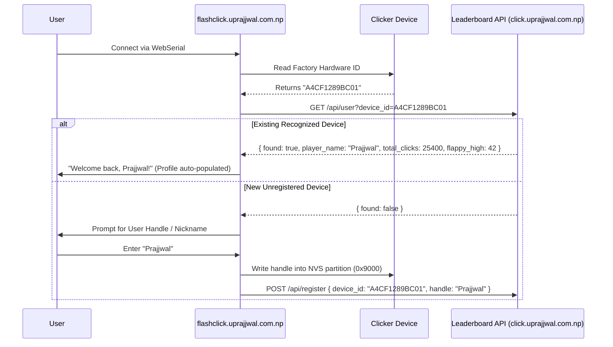

# Unique Device Identification & Leaderboard Persistence Architecture

This document describes how Clicker devices are uniquely identified via immutable factory hardware signatures, how the WebSerial browser flasher auto-recognizes returning users, and the multi-applet database synchronization model for the community leaderboard.

---

## 1. Hardware Unique Identifiers

### A. ESP32 Factory eFuse MAC (`firmware/src/device_info.hpp`)
Each ESP32 unit derives an immutable 48-bit hardware identifier burned into eFuse silicon at the factory:

```cpp
#pragma once
#include <Arduino.h>
#include <esp_system.h>

class DeviceInfo {
public:
    static String getID() {
        uint64_t chipid = ESP.getEfuseMac();
        char idStr[13];
        snprintf(idStr, sizeof(idStr), "%04X%08X", 
                 (uint16_t)(chipid >> 32), 
                 (uint32_t)chipid);
        return String(idStr); // Returns a clean 12-char hex ID like "A4CF1289BC01"
    }

    static String getFormattedMac() {
        uint64_t chipid = ESP.getEfuseMac();
        uint8_t* mac = (uint8_t*)&chipid;
        char macStr[18];
        snprintf(macStr, sizeof(macStr), "%02X:%02X:%02X:%02X:%02X:%02X",
                 mac[0], mac[1], mac[2], mac[3], mac[4], mac[5]);
        return String(macStr); // e.g. "A4:CF:12:89:BC:01"
    }
};
```

### B. Next-Gen RP2354A Silicon ID (Click 4 Revision)
On the Raspberry Pi RP2354A platform, hardware identity is derived from the on-chip OTP memory / 64-bit Unique Board ID:

```c
#include "pico/unique_id.h"

pico_unique_board_id_t id;
pico_get_unique_board_id(&id);
// Generates a permanent 16-character hex string unique to the silicon die
```

---

## 2. WebSerial Identification Flow (`flashclick.uprajjwal.com.np`)



1. **Hardware ID Interrogation**: The WebSerial interface communicates with the device bootloader/runtime over USB Serial and queries the permanent hardware ID.
2. **Cloud Profile Query**: The browser dispatches a `GET` request to `/api/user?device_id=...`.
3. **Auto-Prefill & Returning Player Recognition**:
   - **Existing Player**: If found in the database, the player's handle and accumulated metrics are restored without manual re-entry.
   - **New Player**: The user enters their chosen handle, which is written to the NVS storage partition (`0x9000`) and posted to the registry API.

---

## 3. Multi-Game Database Schema & UPSERT Queries

The central database tracks player profiles and high scores across all installed game applets:

```sql
CREATE TABLE leaderboard (
    device_id VARCHAR(32) PRIMARY KEY,      -- Unique Silicon ID (eFuse MAC or RP2354 OTP)
    player_name VARCHAR(32) NOT NULL,       -- Registered Player Nickname
    total_clicks BIGINT DEFAULT 0,          -- Lifetime Sisyphus Clicks
    sisyphus_cycles INT DEFAULT 0,          -- Mountain Ascent Cycles Completed
    just_ten_best_diff_ms INT DEFAULT 9999, -- Timing deviation from 10.0000s in ms
    flappy_high_score INT DEFAULT 0,        -- Best Flappy Bird obstacle score
    hardware_model VARCHAR(16) DEFAULT 'ESP32', -- 'ESP32' or 'CLICK4_RP2354'
    firmware_version VARCHAR(16) NOT NULL,
    last_updated TIMESTAMP WITH TIME ZONE DEFAULT CURRENT_TIMESTAMP
);
```

### Multi-Game UPSERT Query
```sql
INSERT INTO leaderboard (
    device_id, player_name, total_clicks, sisyphus_cycles,
    just_ten_best_diff_ms, flappy_high_score, hardware_model,
    firmware_version, last_updated
)
VALUES ($1, $2, $3, $4, $5, $6, $7, $8, CURRENT_TIMESTAMP)
ON CONFLICT (device_id) DO UPDATE SET
    player_name = EXCLUDED.player_name,
    total_clicks = GREATEST(leaderboard.total_clicks, EXCLUDED.total_clicks),
    sisyphus_cycles = GREATEST(leaderboard.sisyphus_cycles, EXCLUDED.sisyphus_cycles),
    just_ten_best_diff_ms = LEAST(leaderboard.just_ten_best_diff_ms, EXCLUDED.just_ten_best_diff_ms),
    flappy_high_score = GREATEST(leaderboard.flappy_high_score, EXCLUDED.flappy_high_score),
    firmware_version = EXCLUDED.firmware_version,
    last_updated = CURRENT_TIMESTAMP;
```
