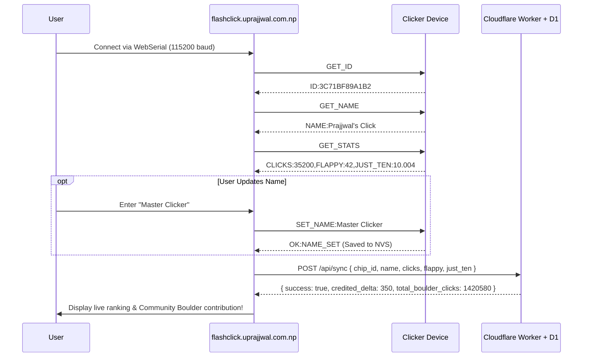

# Unique Device Identification & Leaderboard Persistence Architecture

This document describes how Clicker devices are uniquely identified via immutable factory hardware signatures, how the WebSerial browser flasher auto-recognizes returning users, and the multi-applet database synchronization model for the community leaderboard.

---

## 1. Hardware Unique Identifiers

### A. ESP32 Factory eFuse MAC & Custom Name (`firmware/src/system/device_info.hpp`)
Each ESP32 unit derives an immutable 48-bit hardware identifier burned into eFuse silicon at the factory, paired with an NVS-backed customizable owner name:

```cpp
#pragma once
#include <Arduino.h>
#include <esp_system.h>

class DeviceInfo {
public:
    static String getID() {
        uint64_t chipid = ESP.getEfuseMac();
        char idStr[13];
        snprintf(idStr, sizeof(idStr), "%04X%08X", 
                 (uint16_t)(chipid >> 32), 
                 (uint32_t)chipid);
        return String(idStr); // Returns a clean 12-char hex ID like "3C71BF89A1B2"
    }

    static String getFormattedMac() {
        uint64_t chipid = ESP.getEfuseMac();
        uint8_t* mac = (uint8_t*)&chipid;
        char macStr[18];
        snprintf(macStr, sizeof(macStr), "%02X:%02X:%02X:%02X:%02X:%02X",
                 mac[0], mac[1], mac[2], mac[3], mac[4], mac[5]);
        return String(macStr); // e.g. "3C:71:BF:89:A1:B2"
    }

    // Dynamic Bootscreen Name Personalization
    static String getCustomName();
    static bool setCustomName(const String& name);
    static bool hasCustomName();
};
```

### B. Next-Gen RP2354A Silicon ID (Click 4 Revision)
On the Raspberry Pi RP2354A platform, hardware identity is derived from the on-chip OTP memory / 64-bit Unique Board ID:

```c
#include "pico/unique_id.h"

pico_unique_board_id_t id;
pico_get_unique_board_id(&id);
// Generates a permanent 16-character hex string unique to the silicon die
```

---

## 2. WebSerial Bi-Directional Protocol (`flashclick.uprajjwal.com.np`)



---

## 3. Cloudflare D1 Serverless Database Schema (`server/schema.sql`)

The database is built on **Cloudflare D1 (Edge SQLite)**, ensuring instantaneous global read/write performance with ACID compliance and zero hosting costs:

```sql
-- D1 SQLite Schema for Click Community Leaderboard

CREATE TABLE IF NOT EXISTS global_stats (
    id INTEGER PRIMARY KEY CHECK (id = 1),
    total_boulder_clicks INTEGER NOT NULL DEFAULT 0,
    total_devices INTEGER NOT NULL DEFAULT 0,
    last_updated DATETIME DEFAULT CURRENT_TIMESTAMP
);

CREATE TABLE IF NOT EXISTS devices (
    chip_id TEXT PRIMARY KEY,
    device_name TEXT NOT NULL,
    total_clicks INTEGER NOT NULL DEFAULT 0,
    last_synced_clicks INTEGER NOT NULL DEFAULT 0,
    last_synced_at DATETIME DEFAULT CURRENT_TIMESTAMP,
    flappy_high_score INTEGER NOT NULL DEFAULT 0,
    just_ten_time REAL NOT NULL DEFAULT 0,
    just_ten_best_ms INTEGER NOT NULL DEFAULT 0,
    uptime_hrs INTEGER NOT NULL DEFAULT 0,
    verified INTEGER NOT NULL DEFAULT 1,
    created_at DATETIME DEFAULT CURRENT_TIMESTAMP
);

CREATE TABLE IF NOT EXISTS sync_log (
    id INTEGER PRIMARY KEY AUTOINCREMENT,
    chip_id TEXT NOT NULL,
    delta_claimed INTEGER NOT NULL,
    delta_credited INTEGER NOT NULL,
    ip_hash TEXT,
    synced_at DATETIME DEFAULT CURRENT_TIMESTAMP
);

CREATE INDEX IF NOT EXISTS idx_devices_clicks ON devices(total_clicks DESC);
CREATE INDEX IF NOT EXISTS idx_devices_flappy ON devices(flappy_high_score DESC);
```

