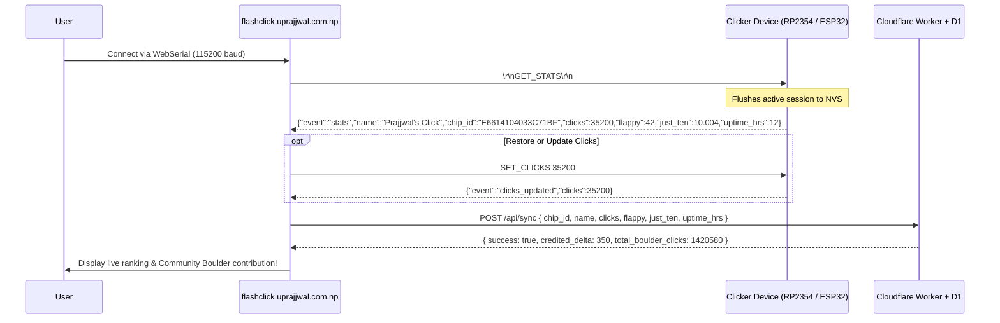

# Unique Device Identification & Leaderboard Persistence Architecture

This document describes how Clicker devices are uniquely identified via immutable factory hardware signatures, how the WebSerial browser flasher auto-recognizes returning users, and the multi-applet database synchronization model for the community leaderboard.

---

## 1. Hardware Unique Identifiers

### A. Active Production Silicon: RP2354A Unique Board ID (`firmware/src/system/device_info.hpp`)
On the **Click 4 (Raspberry Pi RP2354A)** platform, hardware identity is derived from the on-chip OTP / Flash silicon factory unique ID via the Raspberry Pi Pico C SDK:

```cpp
#include <pico/unique_id.h>

pico_unique_board_id_t id;
pico_get_unique_board_id(&id);
// Formats 8 raw bytes into a permanent 16-character hex string (e.g. "E6614104033C71BF")
```

The unified `DeviceInfo::getID()` implementation handles both architectures transparently:

```cpp
#pragma once
#include <Arduino.h>
#include <Preferences.h>
#if defined(ESP32)
#include <esp_system.h>
#elif defined(ARDUINO_ARCH_RP2040)
#include <pico/unique_id.h>
#endif

class DeviceInfo {
public:
    static String getID() {
#if defined(ESP32)
        uint64_t chipid = ESP.getEfuseMac();
        char idStr[13];
        snprintf(idStr, sizeof(idStr), "%04X%08X", 
                 (uint16_t)(chipid >> 32), 
                 (uint32_t)chipid);
        return String(idStr); // Clean 12-char hex ID like "3C71BF89A1B2"
#elif defined(ARDUINO_ARCH_RP2040)
        pico_unique_board_id_t id;
        pico_get_unique_board_id(&id);
        char idStr[17];
        snprintf(idStr, sizeof(idStr), "%02X%02X%02X%02X%02X%02X%02X%02X",
                 id.id[0], id.id[1], id.id[2], id.id[3],
                 id.id[4], id.id[5], id.id[6], id.id[7]);
        return String(idStr); // Clean 16-char hex ID like "E6614104033C71BF"
#else
        return String("CLICKER000000");
#endif
    }

    static const char* getCustomName();
    static void setCustomName(const char* newName);
};
```

### B. Legacy Prototype Silicon: ESP32 Factory eFuse MAC
On the legacy **Click 1 Prototype (ESP32-WROOM-32E)** platform, the identifier is read from factory eFuse silicon via `ESP.getEfuseMac()`, returning a 12-character hexadecimal string (e.g. `3C71BF89A1B2`).

### C. Persistent Custom Name Personalization
Owners can assign a custom handle that displays on the physical OLED boot splash screen:
1. **Binary Signature Matching**: Firmware binaries can embed a magic rodata signature (`__CLICK_NAME__:<name>:__END_NAME___`), allowing the Web Flasher to personalize pre-compiled binaries before flashing.
2. **NVS Storage Fallback**: The name can also be written to persistent non-volatile storage (`clicker_cfg` namespace, key `custom_name`). Defaults to `"CLICKER"` if unset.

---

## 2. WebSerial Bi-Directional Protocol (`flashclick.uprajjwal.com.np`)


```mermaid
sequenceDiagram
    participant User
    participant WebFlasher as flashclick.uprajjwal.com.np
    participant Device as Clicker Device (RP2354 / ESP32)
    participant Cloud as Cloudflare Worker + D1

    User->>WebFlasher: Connect via WebSerial (115200 baud)
    WebFlasher->>Device: \r\nGET_STATS\r\n
    Note over Device: Flushes active session to NVS
    Device-->>WebFlasher: {"event":"stats","name":"Prajjwal's Click","chip_id":"E6614104033C71BF","clicks":35200,"flappy":42,"just_ten":10.004,"uptime_hrs":12}

    opt Restore or Update Clicks
        WebFlasher->>Device: SET_CLICKS 35200
        Device-->>WebFlasher: {"event":"clicks_updated","clicks":35200}
    end

    WebFlasher->>Cloud: POST /api/sync { chip_id, name, clicks, flappy, just_ten, uptime_hrs }
    Cloud-->>WebFlasher: { success: true, credited_delta: 350, total_boulder_clicks: 1420580 }
    WebFlasher->>User: Display live ranking & Community Boulder contribution!
```

---

## 3. Cloudflare D1 Serverless Database Schema (`server/schema.sql`)

The database is built on **Cloudflare D1 (Edge SQLite)**, ensuring instantaneous global read/write performance with ACID compliance and zero hosting costs:

```sql
-- D1 SQLite Schema for Click Community Leaderboard

CREATE TABLE IF NOT EXISTS global_stats (
    id INTEGER PRIMARY KEY CHECK (id = 1),
    total_boulder_clicks INTEGER NOT NULL DEFAULT 0,
    total_devices INTEGER NOT NULL DEFAULT 0,
    last_updated DATETIME DEFAULT CURRENT_TIMESTAMP
);

CREATE TABLE IF NOT EXISTS devices (
    chip_id TEXT PRIMARY KEY,
    device_name TEXT NOT NULL,
    total_clicks INTEGER NOT NULL DEFAULT 0,
    last_synced_clicks INTEGER NOT NULL DEFAULT 0,
    last_synced_at DATETIME DEFAULT CURRENT_TIMESTAMP,
    flappy_high_score INTEGER NOT NULL DEFAULT 0,
    just_ten_time REAL NOT NULL DEFAULT 0,
    just_ten_best_ms INTEGER NOT NULL DEFAULT 0,
    uptime_hrs INTEGER NOT NULL DEFAULT 0,
    verified INTEGER NOT NULL DEFAULT 1,
    created_at DATETIME DEFAULT CURRENT_TIMESTAMP
);

CREATE TABLE IF NOT EXISTS sync_log (
    id INTEGER PRIMARY KEY AUTOINCREMENT,
    chip_id TEXT NOT NULL,
    delta_claimed INTEGER NOT NULL,
    delta_credited INTEGER NOT NULL,
    ip_hash TEXT,
    synced_at DATETIME DEFAULT CURRENT_TIMESTAMP
);

CREATE INDEX IF NOT EXISTS idx_devices_clicks ON devices(total_clicks DESC);
CREATE INDEX IF NOT EXISTS idx_devices_flappy ON devices(flappy_high_score DESC);
```
