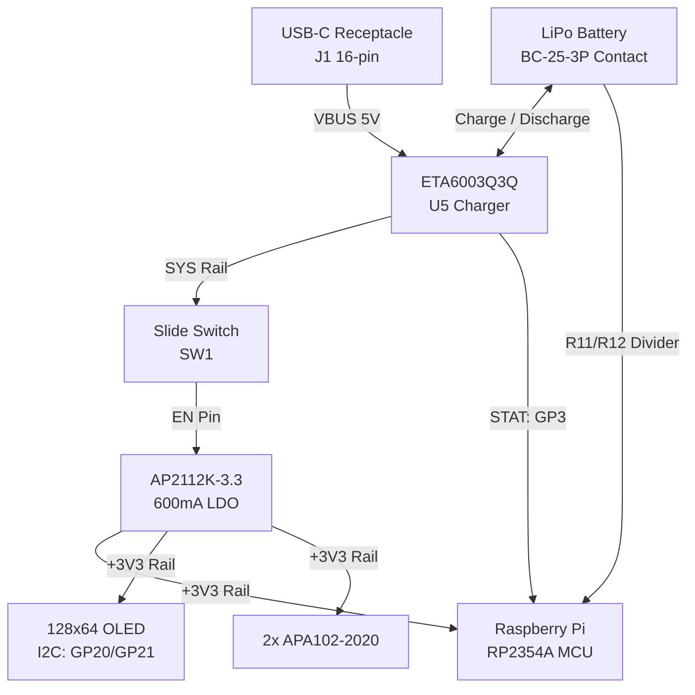

# Hardware Architecture & Pin Profiles Specification

This document provides the authoritative hardware reference for the Clicker project, documenting the active **Click 1 Prototyping Platform (ESP32-WROOM-32E)** and the upcoming **Click 4 PCBA Design (RP2354A - JLCPCB Production V0.0.1)**.

> [!IMPORTANT]
> **Active Firmware vs. Hardware Roadmap**:
> 1. **Active Prototyping Platform (Click 1)**:
>    - KiCad Files: `hardware/PCB/Click1/` (`click.kicad_sch`, `click.kicad_pcb`).
>    - The current prototype was fabricated manually. An ESP32 was chosen because of component availability, hand-solderability, and built-in USB/radio features.
>    - **All active embedded firmware in `firmware/`, pin definitions, build environments (`platformio.ini`), and WebSerial flasher profiles are targeted exclusively for this ESP32-WROOM-32E hardware.**
> 2. **Next-Generation Production Hardware (Click 4 - V0.0.1)**:
>    - KiCad & PCBA Files: `hardware/PCB/Click4/` (`Click4.kicad_sch`, `Click4.kicad_pcb`, `Click4.step`).
>    - Fully routed and designed for turnkey assembly (PCBA) through **JLCPCB** for the **V0.0.1** production run.
>    - Utilizes the high-density Raspberry Pi **RP2354A** MCU. Hand-assembly is not feasible due to fine-pitch QFN and 0402 packaging, so physical testing will occur once fabricated boards arrive.
>    - **Firmware adaptation for RP2354A will take place once the JLCPCB hardware is delivered.**

---

## Active Hardware Pinout & Specs (Click 1 Prototype - ESP32-WROOM-32E)
*Source of truth for all current firmware in `firmware/`*

- **Microcontroller**: ESP32-WROOM-32E (Xtensa Dual-Core 240MHz, 4MB Flash)
- **Display I2C (`J2`)**: 128×64 SSD1306 Monochrome OLED
  - **SDA**: `GPIO 21` (Pad 33)
  - **SCL**: `GPIO 22` (Pad 36)
  - Bus Speed: 400kHz Fast I2C (*Note: GPIO 36 / SENSOR_VP is input-only and never used*)
- **User Inputs**:
  - **MODE Button (`S1`)**: `GPIO 14` (Pad 13) &rarr; Active LOW, internal pull-up, RTC ext0 wake capable
  - **ACTION Button (`S2`)**: `GPIO 32` (Pad 8) &rarr; Active LOW, internal pull-up, RTC ext1 wake capable
- **Power & Battery Subsystem**:
  - **Battery Voltage Sense**: `GPIO 35` (Pad 7 / `Vol_Dvd`) via 100kΩ / 100kΩ resistor divider (12-bit ADC)
  - **Charger Status (`STAT`)**: `GPIO 33` (Pad 9 / `/STAT`) from ETA6003 charging IC (Active LOW)
  - **Battery Charger**: ETA6003Q3Q Li-Ion charging management IC (`U1`/`U4`)
  - **Voltage Regulator**: HT7833 (`U2`) 3.3V 500mA ultra-low quiescent current LDO
- **USB & Debug Interface**:
  - **USB-to-UART Bridge**: CH340C (`U3`) with built-in clock oscillator
  - **Auto-Programming Circuit**: Dual MMBT3904 NPN transistors (`Q2`, `Q4`) with DTR/RTS auto-reset
  - **UART Console**: `TXD0` = `GPIO 1` (Pad 34), `RXD0` = `GPIO 3` (Pad 35)
  - **Sleep Pad Isolation**: Both UART pins held in sleep (`gpio_hold_en`) to prevent back-powering CH340C
- **Sleep Modes**: Light sleep at 20s idle (OLED off, I2C pullups maintained), Deep sleep at 45s (RTC wakeup)

---

## Upcoming Hardware Pinout & Specs (Click 4 / V4 PCBA - JLCPCB V0.0.1)
*Design complete; PCBA order queued for JLCPCB fabrication*

- **Microcontroller**: RP2354A (QFN-56 package, 30 GPIOs: GP0-GP29) with 4MB internal QSPI Flash
- **Display I2C**: SDA = GP20, SCL = GP21 (400kHz Fast I2C, shared with RTC)
- **User Inputs**: 
  - **MODE Switch**: GP14
  - **ACTION Switch**: GP32 (or assigned GP)
  - Mechanical switch footprints: Dual Cherry MX style PCB sockets (`S1`, `S2`)
- **Power & Battery Management**:
  - **Charge Controller**: ETA6003Q3Q switching Li-Ion charger with 2.2µH power inductor (`L3`)
  - **Charge Status (`STAT`)**: GP3 (or assigned GP)
  - **Battery Monitor (`BAT_ADC`)**: GP29 (ADC3) via 100kΩ / 100kΩ divider (`Vol_Dvd`)
  - **Voltage Regulator**: AP2112K-3.3 600mA ultra-low-dropout LDO (`U2`) with EN tied to physical slide switch (`SW1`)
- **Peripherals & Feedback**:
  - **Audio**: Magnetic buzzer (`KLJ-5030-5040`) driven by MMBT3904 NPN BJT on GP27
  - **RGB Lighting**: 2× daisy-chained APA102-2020 addressable clocked LEDs (Data = GP11, Clock = GP12)
  - **Real-Time Clock**: NXP PCF8563TS I2C RTC with 32.768 kHz crystal (`Y2`)
- **Connector**: 16-pin USB Type-C receptacle (`J1`) with 5.1kΩ CC pull-downs

---

## 1. Side-by-Side Comparison Matrix

| Subsystem / Feature | Active Prototype (Click 1: ESP32-WROOM-32E) | Upcoming Production (Click 4: RP2354A V0.0.1) | Production Rationale / Electrical Notes |
|:---|:---|:---|:---|
| **Board Revision** | **Click 1** (`hardware/PCB/Click1/`) | **Click 4** (`hardware/PCB/Click4/`) | Prototype (Manual assembly) vs. Turnkey JLCPCB PCBA |
| **MCU Silicon** | ESP32-WROOM-32E (Xtensa Dual-Core) | Raspberry Pi RP2354A (Dual Cortex-M33 / Hazard3) | 3.3V Logic; RP2354A integrates 4MB on-chip QSPI flash |
| **Firmware Status** | **Active & running in `firmware/`** | **Design complete; firmware pending board delivery** | Code will be updated/ported when hardware arrives |
| **I2C SDA (Display)** | `GPIO 21` (Pad 33) | `GP20` (Pads / Shared bus) | Open Drain, Pull-up to 3.3V |
| **I2C SCL (Display)** | `GPIO 22` (Pad 36) | `GP21` (Pads / Shared bus) | 400kHz Fast I2C (GPIO 36 on ESP32 is strictly input-only) |
| **Primary Input (ACTION)** | `GPIO 32` (Pad 8, switch S2) | `GP32` (or assigned GP, switch S1) | Active LOW, internal pull-up |
| **Secondary Input (MODE)**| `GPIO 14` (Pad 13, switch S1) | `GP14` (switch S2) | Active LOW, internal pull-up |
| **Key Switches** | Tactile pushbuttons | Cherry MX mechanical keyboard switches | Premium mechanical tactile feel on Click 4 |
| **Battery Charger** | ETA6003Q3Q (`U1`/`U4`) | ETA6003Q3Q (`U5`) with 2.2µH inductor | High-efficiency switching Li-Ion charging |
| **Charger Status (`STAT`)**| `GPIO 33` (Active LOW) | `GP3` (or assigned GP) | LOW = Active charging cycle, HIGH = Standby |
| **Battery Sense (`ADC`)** | `GPIO 35` (100k/100k divider) | `GP29` / ADC3 (100k/100k divider) | Piece-wise LiPo discharge mapping |
| **Voltage Regulator** | HT7833 (3.3V 500mA LDO) | AP2112K-3.3 (3.3V 600mA Ultra-Low-Dropout) | Slide switch `SW1` directly toggles AP2112K `EN` line |
| **USB Interface** | CH340C USB-to-UART + Type-C | Native USB 2.0 Full Speed + Type-C | Native USB eliminates discrete bridge IC on Click 4 |
| **Audio / Haptics** | N/A | Magnetic Buzzer (GP27 via MMBT3904) | High-pitch auditory feedback for clicks & milestones |
| **RGB Lighting** | N/A | 2× APA102-2020 Clocked LEDs (GP11 / GP12) | Synchronous two-wire RGB animation |
| **Real-Time Clock** | Internal software millis / NVS | PCF8563TS I2C RTC with 32.768kHz crystal | Dedicated hardware timekeeping battery backed |

---

## 2. Power Architecture & Battery Management

### A. Click 1 Prototype Power Design
- **Power Ingestion**: USB-C 5V VBUS charges single-cell 3.7V Li-Ion / LiPo battery through ETA6003.
- **Regulation**: Holtek HT7833 low-dropout linear regulator supplies +3.3V rail to ESP32-WROOM-32E and SSD1306 OLED.
- **Sleep Optimization (`firmware/src/PowerManager.h`)**:
  - **Light Sleep (20s)**: Shuts down SSD1306 via software command, isolates CH340C TX/RX lines via `gpio_hold_en` to prevent phantom current drain, arms RTC GPIO wake on GPIO 14 / GPIO 32.
  - **Deep Sleep (45s)**: Shuts down XTAL/CPU domains while preserving NVS partition data at `0x9000`.

### B. Click 4 Production Power Architecture

