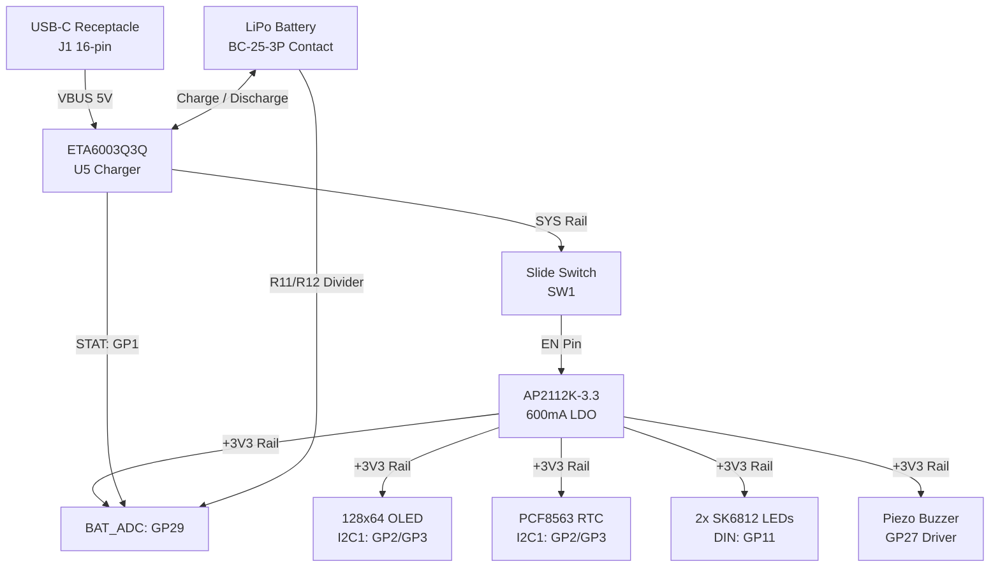

# Hardware Architecture & Pin Profiles Specification

This document provides the authoritative hardware reference for the Clicker project, documenting the active **Click 4 PCBA Platform (RP2354A)** and the legacy **Click 1 Prototyping Platform (ESP32-WROOM-32E)**.

> [!IMPORTANT]
> **Active Production Hardware**:
> 1. **Click 4 (RP2354A) - Primary Active Platform**:
>    - KiCad & PCBA Files: `hardware/PCB/Click4/` (`Click4.kicad_sch`, `Click4.kicad_pcb`, `Click4.step`).
>    - Features the Raspberry Pi **RP2354A** MCU (Dual Cortex-M33 with 4MB embedded QSPI Flash).
>    - Active default PlatformIO environment: `env:rp2354` in `platformio.ini`.
>    - Supports native USB 2.0 Full Speed flashing and debugging via `picotool`.
> 2. **Click 1 (ESP32-WROOM-32E) - Initial Hand-Assembled Prototype**:
>    - KiCad Files: `hardware/PCB/Click1/` (`click.kicad_sch`, `click.kicad_pcb`).
>    - Maintained for legacy compatibility under `env:esp32doit-devkit-v1`.

---

## Active Hardware Pinout & Specs (Click 4 PCBA - Raspberry Pi RP2354A)
*Authoritative pin routing defined in [`firmware/src/system/PinConfig.h`](file:///Users/prajjwal/Documents/GitHub/Click/firmware/src/system/PinConfig.h)*

- **Microcontroller**: Raspberry Pi RP2354A (QFN-56 package, 30 GPIOs: GP0–GP29, 512KB SRAM, 4MB on-chip QSPI Flash)
- **Display & RTC I2C Bus (`CLICK_I2C = Wire1`)**:
  - **SDA**: `GP2` (I2C1 SDA, Pin 4)
  - **SCL**: `GP3` (I2C1 SCL, Pin 5)
  - **Bus Speed**: 400kHz Fast I2C
  - **Peripherals**: 128×64 SSD1306 Monochrome OLED (`0x3C`) + NXP PCF8563 Real-Time Clock (`0x51`)
- **User Inputs**:
  - **MODE Button (`S1`)**: `GP0` (Active LOW, internal pull-up, level-sensitive wake capable)
  - **ACTION Button (`S2`)**: `BOOTSEL` / `QSPI_SS` (Active LOW, dual-purpose game click & bootloader pin)
- **Power & Battery Subsystem**:
  - **Battery Voltage Sense**: `GP29` (ADC3 / Pad 41) via 100kΩ / 100kΩ divider (2.0x factor, 12-bit ADC)
  - **Charger Status (`STAT`)**: `GP1` (Pad 3) &rarr; Driven by ETA6003 `STAT` pin (Active LOW while charging, 10kΩ pullup `R9` to +3V3)
  - **Battery Charger**: ETA6003Q3Q switching Li-Ion charging controller (`U5`) with 2.2µH power inductor (`L3`)
  - **Voltage Regulator**: Diodes Inc. AP2112K-3.3 (`U2`) 3.3V 600mA ultra-low-dropout regulator (EN tied to slide switch `SW1`)
- **Visual & Auditory Feedback**:
  - **RGB Lighting**: 2× SK6812/WS2812 addressable RGB LEDs daisy-chained on `GP11` (DIN) driven by PIO state machine
  - **Audio Buzzer**: Magnetic piezo buzzer driven via MMBT3904 NPN BJT on `GP27`
- **Native USB Interface**:
  - Direct USB DP/DM routing on RP2354 pads to 16-pin USB Type-C receptacle (`J1`) with 5.1kΩ CC resistors.
  - Native CDC serial telemetry & WebSerial flashing at 115200 baud.

---

## Legacy Hardware Pinout & Specs (Click 1 Prototype - ESP32-WROOM-32E)
*Maintained under `firmware/src/system/PinConfig.h` for ESP32 builds*

- **Microcontroller**: ESP32-WROOM-32E (Xtensa Dual-Core 240MHz, 4MB Flash)
- **Display I2C (`J2`)**: 128×64 SSD1306 Monochrome OLED
  - **SDA**: `GPIO 21` (Pad 33)
  - **SCL**: `GPIO 22` (Pad 36)
  - Bus Speed: 400kHz Fast I2C
- **User Inputs**:
  - **MODE Button (`S1`)**: `GPIO 14` (Pad 13) &rarr; Active LOW, internal pull-up, RTC ext0 wake capable
  - **ACTION Button (`S2`)**: `GPIO 32` (Pad 8) &rarr; Active LOW, internal pull-up, RTC ext1 wake capable
- **Power & Battery Subsystem**:
  - **Battery Voltage Sense**: `GPIO 35` via 100kΩ / 100kΩ resistor divider (12-bit ADC)
  - **Charger Status (`STAT`)**: `GPIO 33` from ETA6003 charging IC (Active LOW)
  - **Battery Charger**: ETA6003Q3Q Li-Ion charging management IC
  - **Voltage Regulator**: HT7833 3.3V 500mA LDO
- **USB & Debug Interface**:
  - **USB-to-UART Bridge**: CH340C with built-in clock oscillator
  - **UART Console**: `TXD0` = `GPIO 1`, `RXD0` = `GPIO 3` (isolated with pad holds in sleep)
  - **Real-Time Clock**: NXP PCF8563TS I2C RTC with 32.768 kHz crystal (`Y2`)
- **Connector**: 16-pin USB Type-C receptacle (`J1`) with 5.1kΩ CC pull-downs

---

## 1. Side-by-Side Comparison Matrix

| Subsystem / Feature | Active Platform (Click 4: RP2354A) | Legacy Prototype (Click 1: ESP32) | Hardware & Pinout Rationale |
|:---|:---|:---|:---|
| **Board Revision** | **Click 4** (`hardware/PCB/Click4/`) | **Click 1** (`hardware/PCB/Click1/`) | Production PCBA vs. Initial manual prototype |
| **MCU Silicon** | Raspberry Pi RP2354A (Dual Cortex-M33) | ESP32-WROOM-32E (Xtensa Dual-Core) | RP2354A features 512KB RAM & 4MB internal QSPI flash |
| **Default Build Env** | `env:rp2354` (PlatformIO) | `env:esp32doit-devkit-v1` | Compiled with earlephilhower arduino-pico core |
| **I2C SDA (Display/RTC)** | `GP2` (I2C1 SDA) | `GPIO 21` | Shared 400kHz Fast I2C bus for SSD1306 and PCF8563 |
| **I2C SCL (Display/RTC)** | `GP3` (I2C1 SCL) | `GPIO 22` | External pull-ups to +3V3 rail |
| **Primary Input (ACTION)**| `BOOTSEL` / `QSPI_SS` | `GPIO 32` | Dual-purpose hardware game click & flash bootloader |
| **Secondary Input (MODE)** | `GP0` (Active LOW) | `GPIO 14` | Applet switching & settings hold trigger |
| **Key Switches** | Cherry MX style PCB sockets | Tactile pushbuttons | High-end mechanical switch tactile feedback |
| **Battery Charger** | ETA6003Q3Q (`U5`) + 2.2µH Inductor | ETA6003Q3Q | High-efficiency switching Li-Ion charging |
| **Charger Status (`STAT`)**| `GP1` (Active LOW, 10kΩ pullup `R9`) | `GPIO 33` | LOW = Charging, HIGH = Battery / Unplugged |
| **Battery Sense (`ADC`)** | `GP29` (ADC3 via 100k/100k divider) | `GPIO 35` (100k/100k divider) | Calibrated non-linear Li-Ion SoC plateau mapping |
| **Voltage Regulator** | AP2112K-3.3 (600mA Low-Dropout LDO) | HT7833 (500mA LDO) | Hardware slide switch `SW1` directly toggles `EN` line |
| **USB Interface** | Native USB 2.0 Full Speed (Type-C) | CH340C USB-to-UART + Type-C | Direct D+/D- routing eliminates discrete bridge IC |
| **Audio / Haptics** | Magnetic Buzzer (GP27 via MMBT3904) | N/A | High-pitch auditory feedback for clicks & game events |
| **RGB Lighting** | 2× SK6812/WS2812 DIN on `GP11` | N/A | Dual addressable LEDs driven by PIO state machine |
| **Real-Time Clock** | NXP PCF8563TS (I2C1: GP2/GP3) | N/A | Dedicated battery-backed 32.768kHz RTC |

---

## 2. Power Architecture & Battery Management

> [!TIP]
> **Complete Technical Deep-Dive**: For exhaustive coverage of power optimization, battery fuel gauging, sleep currents, and silicon gotchas, see the dedicated master guide:
> 🔗 **[`docs/power_management_and_battery_architecture.md`](power_management_and_battery_architecture.md)**

### Click 4 Production Power Architecture

```mermaid
flowchart TD
    USB[USB-C Receptacle\nJ1 16-pin] -->|VBUS 5V| ETA[ETA6003Q3Q\nU5 Charger]
    BATT[LiPo Battery\nBC-25-3P Contact] <-->|Charge / Discharge| ETA
    ETA -->|SYS Rail| SW[Slide Switch\nSW1]
    SW -->|EN Pin| LDO[AP2112K-3.3\n600mA LDO]
    LDO -->|+3V3 Rail| MCU[Raspberry Pi\nRP2354A MCU]
    LDO -->|+3V3 Rail| OLED[128x64 OLED\nI2C1: GP2/GP3]
    LDO -->|+3V3 Rail| RTC[PCF8563 RTC\nI2C1: GP2/GP3]
    LDO -->|+3V3 Rail| LED[2x SK6812 LEDs\nDIN: GP11]
    LDO -->|+3V3 Rail| BUZZ[Piezo Buzzer\nGP27 Driver]
    ETA -->|STAT: GP1| MCU
    BATT -->|R11/R12 Divider| MCU[BAT_ADC: GP29]
```

