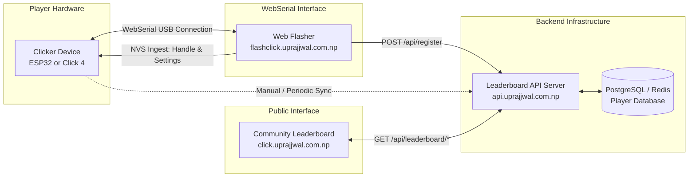

# Web-Connected Leaderboard & Flashing Architecture

This document specifies the end-to-end integration architecture connecting the hardware Clicker device, the browser-based WebSerial flasher, and the community leaderboard.

---

## 1. System Architecture



---

## 2. Pre-Flash Identity & Configuration (`flashclick.uprajjwal.com.np`)

1. **User Identity Ingestion**:
   - The user navigates to `flashclick.uprajjwal.com.np` and clicks "Connect Device".
   - The WebSerial interface reads the hardware unique ID (eFuse MAC on ESP32 or OTP ID on RP2354A).
   - If returning, the player's existing nickname is loaded from the cloud API.
   - If new, the user is prompted to enter a **Player Handle / Nickname**.
2. **NVS Partition Injection (`0x9000`)**:
   - During flashing, user metadata is written into the NVS storage partition offset (`0x9000`):
     - `user_handle`: String (e.g. `"Prajjwal"`)
     - `device_id`: Hardware ID (e.g. `"A4CF1289BC01"`)
     - `registered_ts`: UNIX epoch timestamp
3. **Database Registration Payload**:
   - Upon successful flashing, the browser sends an HTTP POST payload to the backend API:
     ```json
     {
       "device_id": "A4CF1289BC01",
       "handle": "Prajjwal",
       "firmware_version": "v1.0.3",
       "hardware_model": "ESP32",
       "registered_at": 1757670000
     }
     ```

---

## 3. Public Leaderboard Endpoints (`click.uprajjwal.com.np`)

The web frontend on `click.uprajjwal.com.np` dynamically renders global rankings and player statistics using the following endpoints:

### A. Lifetime Sisyphus Clicks
* **Endpoint**: `GET /api/leaderboard/lifetime`
* **Response**:
  ```json
  [
    { "rank": 1, "handle": "Prajjwal", "total_clicks": 142050, "sisyphus_cycles": 14, "hardware": "ESP32" },
    { "rank": 2, "handle": "BoulderPusher", "total_clicks": 98200, "sisyphus_cycles": 9, "hardware": "CLICK4_RP2354" }
  ]
  ```

### B. Just Ten Timing Precision
* **Endpoint**: `GET /api/leaderboard/timing_game`
* **Metric**: Lowest absolute deviation from 10.0000 seconds.
* **Response**:
  ```json
  [
    { "rank": 1, "handle": "PrecisionKing", "deviation_ms": 2, "recorded_time": "10.002s" },
    { "rank": 2, "handle": "ChronoMaster", "deviation_ms": 7, "recorded_time": "9.993s" }
  ]
  ```

### C. Flappy Bird High Scores
* **Endpoint**: `GET /api/leaderboard/flappy_bird`
* **Metric**: Highest obstacles cleared in a single continuous flight.
* **Response**:
  ```json
  [
    { "rank": 1, "handle": "Prajjwal", "high_score": 64 },
    { "rank": 2, "handle": "Aviator", "high_score": 51 }
  ]
  ```
