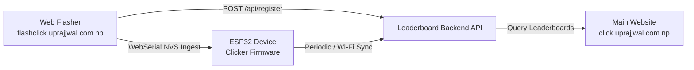

# Web-Connected Leaderboard & Web Flashing Architecture

This document specifies the integration architecture connecting the hardware clicker device, the web flasher, and the community leaderboard.

---

## 1. System Overview



---

## 2. Pre-Flash Configuration (`flashclick.uprajjwal.com.np`)

1. **User Identity Collection**:
   - The user visits `flashclick.uprajjwal.com.np`.
   - The WebSerial interface prompts the user for their **User Handle / Nickname** and optional customization preferences.
2. **NVS Partition Generation (`0x9000`)**:
   - During flashing, user metadata is injected directly into the ESP32 NVS memory space (`0x9000` partition offset).
   - Injected keys:
     - `user_handle`: String (e.g. `"Prajjwal"`)
     - `device_id`: MAC / Unique Chip ID
     - `registered_ts`: UNIX timestamp
3. **Database Registration**:
   - Upon successful flash, the web flasher dispatches an HTTP POST payload to the shared backend database API:
     ```json
     {
       "device_id": "24:6F:28:XX:XX:XX",
       "handle": "Prajjwal",
       "firmware_version": "v2.0.0",
       "registered_at": 1756143000
     }
     ```

---

## 3. Main Site & Live Leaderboard (`click.uprajjwal.com.np`)

1. **Leaderboard Queries**:
   - The frontend on `click.uprajjwal.com.np` queries the backend API endpoints:
     - `GET /api/leaderboard/lifetime`: Top lifetime clicks across registered devices.
     - `GET /api/leaderboard/timing_game`: Closest 10.0000-second timing deviations.
2. **Real-time Updates**:
   - Scores render dynamically with player handles, ranks, and milestone badges.
