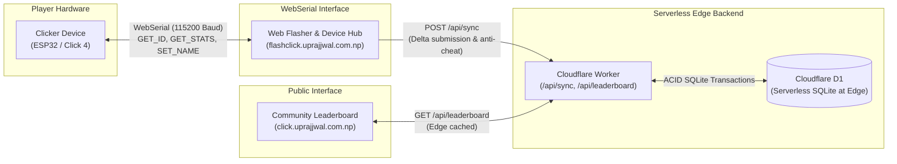

# Web-Connected Leaderboard & Flashing Architecture

This document specifies the end-to-end integration architecture connecting the hardware Clicker device, the browser-based WebSerial flasher, and the community leaderboard.

---

## 1. System Architecture



---

## 2. Device Identity & Personalization Protocol

1. **Hardware Identity Interrogation**:
   - The user connects the Clicker via USB to `flashclick.uprajjwal.com.np` and clicks "Connect Device".
   - The browser opens a WebSerial port at 115200 baud and issues `GET_ID`.
   - The device firmware responds with `ID:<12-hex-chip-id>` (derived from factory eFuse MAC, e.g. `3C71BF89A1B2`).
2. **Personalization & Bootscreen Customization**:
   - Browser sends `GET_NAME` to retrieve the current owner name.
   - The player enters or changes their nickname (e.g. `"Prajjwal's Click"`).
   - Browser issues `SET_NAME:<name>`.
   - Firmware saves the string to the NVS partition (`device` namespace, key `name`).
   - On every boot or reset, the SSD1306 OLED boot screen renders this custom name.
3. **Stat Query & Sync**:
   - Browser issues `GET_STATS`.
   - Firmware queries active applets and returns:
     `CLICKS:25400,FLAPPY:42,JUST_TEN:10.012`
   - Browser sends `POST /api/sync` to the Cloudflare Worker.

---

## 3. The "Community Boulder" Shared Mechanic 🪨

Rather than just isolated individual rankings, every click on every Clicker contributes to the **Global Community Boulder**:
* When a device syncs, the backend calculates:
  $$\Delta_{\text{clicks}} = \text{claimed\_clicks} - \text{last\_synced\_clicks}$$
* If valid, $\Delta_{\text{clicks}}$ is atomically added to `global_stats.total_boulder_clicks`:
  ```sql
  UPDATE global_stats SET total_boulder_clicks = total_boulder_clicks + ? WHERE id = 1;
  ```
* The web app renders the cumulative global progress as a shared mountain climb.

---

## 4. Server-Side Anti-Cheat & Physical Rate Limiting 🛡️

To prevent automated bot scripts or artificial click injection from corrupting the Community Boulder:
1. **Human Click Speed Cap**:
   - Maximum sustained human finger speed is capped at $\le 20 \text{ clicks/second}$.
2. **Elapsed Time Validation**:
   - Time difference $\Delta t = \text{current\_time} - \text{last\_synced\_at}$.
   - Maximum plausible delta: $\Delta_{\text{max}} = 20 \times \Delta t$.
   - Any payload claiming $\Delta_{\text{clicks}} > \Delta_{\text{max}}$ (or negative deltas) is flagged, rejected, or clamped.
3. **Audit Log**:
   - Every sync attempt is recorded in `sync_log` table with `chip_id`, `delta_claimed`, `delta_credited`, and hashed IP address.

---

## 5. Cloudflare Worker API Endpoints

### A. `GET /api/leaderboard`
Returns community stats and Top 10 rankings across all games:
```json
{
  "global_boulder_clicks": 1420580,
  "total_devices": 38,
  "top_sisyphus": [
    { "device_name": "Prajjwal's Click", "total_clicks": 35200, "last_synced_at": "2026-09-13T08:00:00Z" }
  ],
  "top_flappy": [
    { "device_name": "SkyMaster", "flappy_high_score": 42, "last_synced_at": "2026-09-13T08:00:00Z" }
  ],
  "top_timing": [
    { "device_name": "TimeLord", "just_ten_best_ms": 4, "just_ten_time": 10.004, "last_synced_at": "2026-09-13T08:00:00Z" }
  ]
}
```

### B. `POST /api/sync`
Submits hardware metrics with rate-limited crediting:
```json
{
  "chip_id": "3C71BF89A1B2",
  "name": "Prajjwal's Click",
  "clicks": 35200,
  "flappy": 42,
  "just_ten": 10.004,
  "uptime_hrs": 12
}
```
Response:
```json
{
  "success": true,
  "credited_delta": 350,
  "total_boulder_clicks": 1420580,
  "message": "Successfully synced! +350 clicks added to the Community Boulder."
}
```

### C. `GET /api/user?device_id=3C71BF89A1B2`
Retrieves stored profile and metrics for a specific hardware unit.

